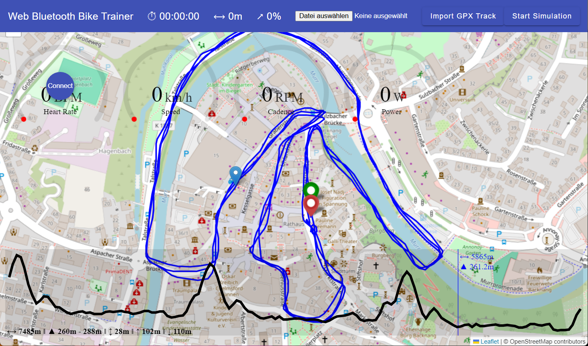

# Web Bluetooth Bike Trainer

[](https://github.com/wklenk/web-bluetooth-bike-trainer/actions/workflows/deploy-to-gh-pages.yml)

Status: Functional

Live demo: https://wklenk.github.io/web-bluetooth-bike-trainer/

Functional to-dos:
* The algorithm to reduce the waypoints is currently very simple. It should get optimized.
* Somehow make sure that there are no abrupt slope changes, without completely destroying the original track charactersistics.
* Start/End of reduced waypoints is unclear.
* Test on bike trainers other then Wahoo Kickr.
* Wheight of person and bike are not reflected.


Started this repository as a christmas holiday project 2023/2024 to experimentally check out if a smart bike trainer (like [Wahoo Kickr](https://www.wahoofitness.com/devices/indoor-cycling/bike-trainers/kickr-buy)) can be controlled by a standalone web application, using the [Web Bluetooth API](https://developer.mozilla.org/en-US/docs/Web/API/Web_Bluetooth_API) of the web browser.

**Disclaimer:** 
* Web Bluetooth might not be supported on all web browsers. To make sure it is enabled in Google Chrome, please follow these instructions: https://www.youtube.com/watch?v=LOmGqTSvoR4&t=1s
* Use on your own risk

## Screenshots

Start screen with GPX track imported.



* The waypoints are visualized on a map.
* At the bottom section, an altitude profile is displayed.
* You can move a cursor over the altitude profile to see details like distance and elevation.
* At the very bottom, you see some overall information about the track.

## Demo mode vs. real Bluetooth Bike Trainer

You can't try out everything by mounting the bike trainer again and again.

Therefore, a demo mode can be activated.

Check file `main.ts`:

````javascript
bootstrapApplication(AppComponent, {
  providers: [
    ...

    // This allows to switch between the BluetoothFitnessMachineService which requires
    // a real Bluetooth Indoor Bike Trainer and the DemoFitnessMachineService, which just
    // simulates one.
    //{ provide: FITNESS_MACHINE_SERVICE, useClass: BluetoothFitnessMachineService },
    { provide: FITNESS_MACHINE_SERVICE, useClass: DemoFitnessMachineService },
  ]
}).catch(err => console.error(err));
````

## How to build and run

Preconditions:
* Recent node version (and npm) installed


Install dependencies

    npm ci

Run development server

    npm run start

Use your browser and open http://localhost:4200 .   

## How to test run on a local web server

One way to run and test the application in a more realistic environment is to use *nginx* as simple web server.

A docker compose config file `docker-compose.yml` is prepared.

Preconditions:

* Docker installed

Run
    npm run build

Use *docker compose* to start up nginx:

    docker compose up

or

    docker compose up -d

then point your browser to http://localhost/web-bluetooth-bike-trainer/ .
    

## Sources
The following sources of information were helpful:

* https://webbluetoothcg.github.io/web-bluetooth/
* https://github.com/WebBluetoothCG/demos?tab=readme-ov-file
* https://googlechrome.github.io/samples/web-bluetooth/index.html
* https://whatsonzwift.com/gpx-to-zwift-workout
* https://github.com/zacharyedwardbull/pycycling
* https://www.bluetooth.com/specifications/specs/fitness-machine-service-1-0/
* https://github.com/oesmith/gatt-xml/blob/master/org.bluetooth.characteristic.indoor_bike_data.xml
* https://support.wahoofitness.com/hc/en-us/articles/4402565219218-A-Guide-to-using-Level-Mode

## Main dependencies

* Angular
* Angular Material
* https://leafletjs.com Leaflet
* https://github.com/mpetazzoni/leaflet-gpx GPX plugin for Leaflet
* https://github.com/ashish-chopra/ngx-gauge A highly customizable Gauge component for Angular apps and dashboards. 
